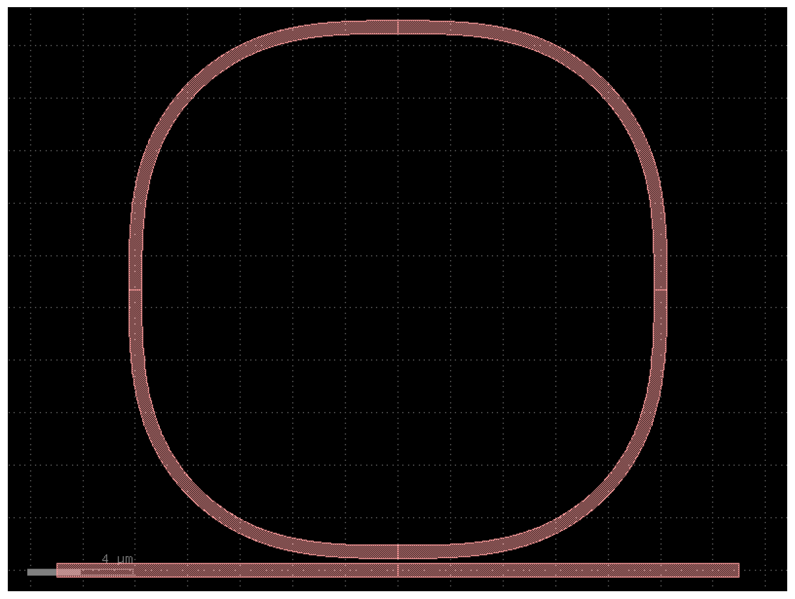
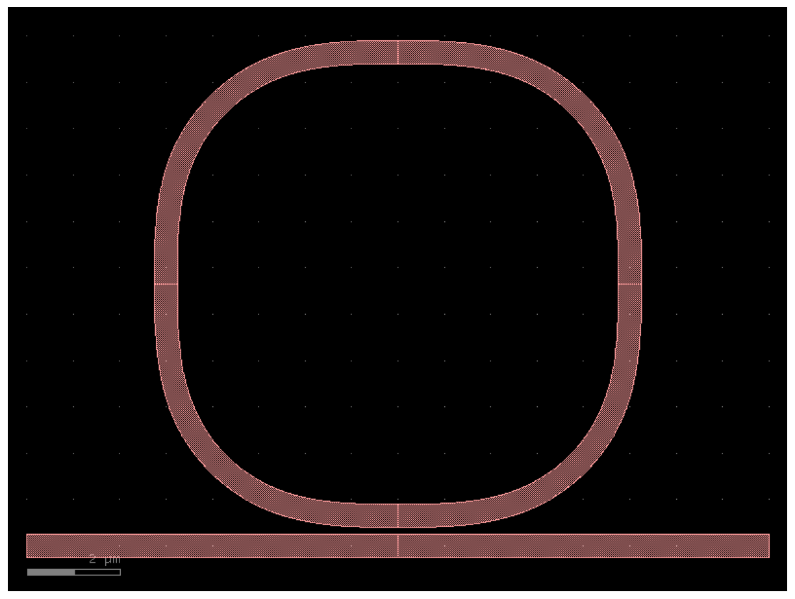
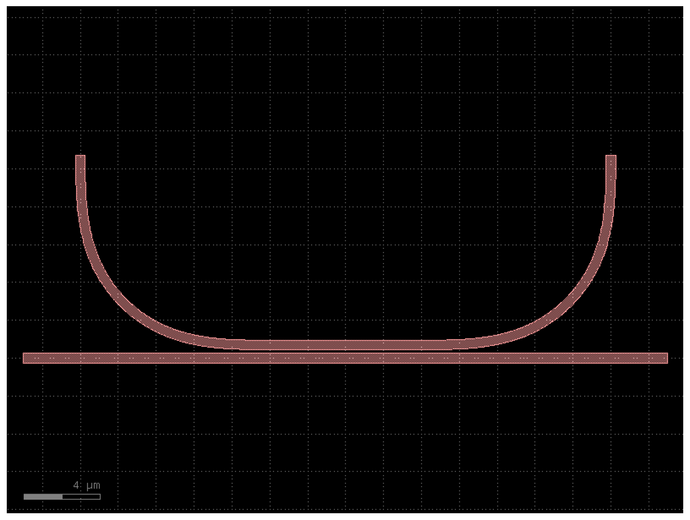
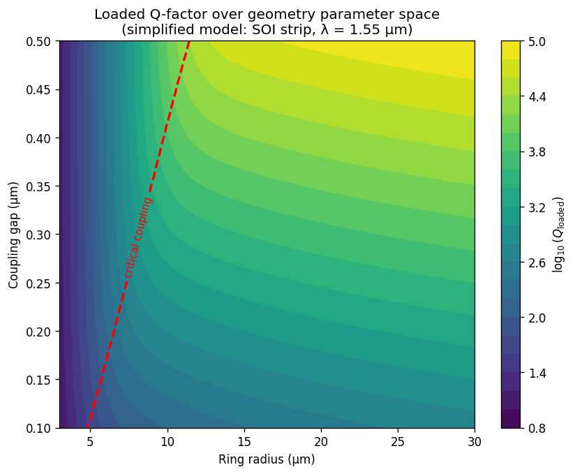

# Ring Resonator Toolkit

[](https://github.com/baburinalex/ring-resonator-toolkit/actions/workflows/tests.yml)
[](https://www.python.org/)
[](LICENSE)
[](https://github.com/astral-sh/ruff)

**Parametric ring resonator design toolkit for silicon photonics — layout generation with [gdsfactory](https://gdsfactory.github.io/gdsfactory/) and FDTD simulation automation through [Lumerical](https://www.ansys.com/products/photonics/lumerical-fdtd)'s Python API.**

<p align="center">
  
</p>

## Why this toolkit

Ring resonators are workhorses of silicon photonics — used in modulators, filters, sensors, and frequency combs. Designing them well requires iterating across a multidimensional parameter space (radius, coupling gap, waveguide width, coupling length) under fabrication and target-spectrum constraints. This toolkit makes that iteration cheap and reproducible:

- **Programmatic layout** — generate any ring geometry from a single Python call, with parameter validation enforcing fabrication and physical bounds.
- **Reproducible simulation** — wrap Lumerical FDTD runs as parameter sweeps that can be re-executed and version-controlled.
- **Analysis pipeline** — extract Q-factor, FSR, extinction ratio, and group index directly from simulation outputs.
- **Test-driven** — every component has unit tests covering geometry, port topology, and parameter validation.

## Features

- 🔧 **Parametric components**: all-pass rings, racetracks, and (planned) add-drop topologies
- ✅ **Pydantic validation**: physical bounds enforced at construction (e.g., gap ≥ 50 nm SOI fab limit)
- 🧪 **23+ unit tests** with `pytest`, including parametrized sweeps
- 🤖 **CI/CD** via GitHub Actions: pytest + ruff on every push, across Python 3.11 and 3.12
- 📦 **Modern Python packaging** with `pyproject.toml` (editable install, optional dev deps)
- 📊 **Analysis utilities** (planned): Q-factor extraction via Lorentzian fit, FSR detection, peak finding

## Component gallery

| Compact ring (R = 5 μm) | Standard ring (R = 10 μm) | Racetrack (R = 10 μm, L = 8 μm) |
|:-:|:-:|:-:|
|  |  |  |

## Installation

Requires Python ≥ 3.10.

```bash
git clone https://github.com/baburinalex/ring-resonator-toolkit.git
cd ring-resonator-toolkit

# Create and activate a virtual environment
python -m venv .venv
source .venv/bin/activate   # On Windows: .\.venv\Scripts\Activate.ps1

# Install with dev dependencies (pytest, ruff, jupyter)
pip install -e ".[dev]"
```

For Lumerical FDTD integration, the `lumapi` Python module must be available — this ships with a Lumerical installation and is typically found in `<Lumerical install dir>/api/python/`.

## Quick start

Generate an all-pass ring resonator and inspect its properties:

```python
from ring_toolkit.components import ring_resonator_all_pass

component = ring_resonator_all_pass(
    radius=10.0,           # μm
    gap=0.2,               # μm — bus-to-ring edge spacing
    waveguide_width=0.5,   # μm
    coupling_length=0.0,   # μm — set > 0 for racetrack geometry
)

print(f"Name: {component.name}")
print(f"Ports: {[p.name for p in component.ports]}")
print(f"Bounding box: {component.bbox_np()}")

# Visualize
component.plot()

# Export to GDSII
component.write_gds("ring.gds")
```

Parameter validation rejects unphysical or unmanufacturable values up front:

```python
>>> ring_resonator_all_pass(gap=0.01)
pydantic_core.ValidationError: gap 0.01 um is below typical fabrication limit (~50 nm)

>>> ring_resonator_all_pass(radius=-5.0)
pydantic_core.ValidationError: Input should be greater than 0
```

## Parameter sweeps

The toolkit is designed around the sweep-and-analyze workflow. Below is an illustrative Q-factor heatmap over the (radius, gap) plane — in practice, populated from `lumapi` FDTD runs:

<p align="center">
  
</p>

The accompanying notebooks (`notebooks/`) demonstrate the full pipeline: parametric layout → batched FDTD simulation → spectrum extraction → Q/FSR analysis.

## Project structure